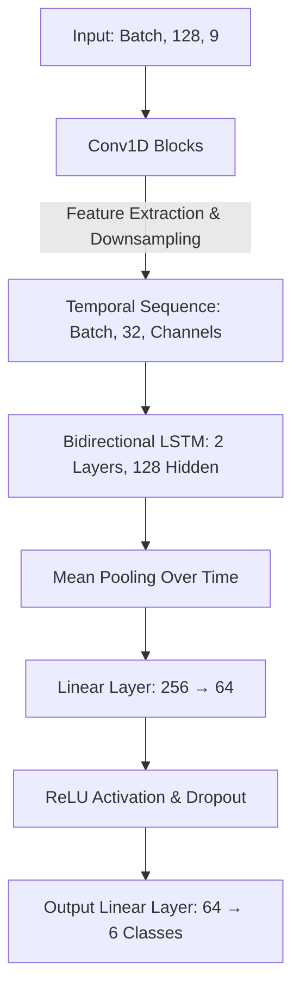

# Human Activity Recognition using CNN-LSTM

An end-to-end deep learning pipeline for **Human Activity Recognition (HAR)** using raw smartphone accelerometer and gyroscope signals. This repository implements a hybrid **CNN-LSTM** architecture in PyTorch, complete with structured data loading, subject-wise validation splitting, and experiment tracking via MLflow.

---

## Dataset Overview

This project utilizes the **UCI HAR Dataset**, which captures 30 subjects performing 6 distinct activities while wearing a smartphone on their waist:

* `WALKING`
* `WALKING_UPSTAIRS`
* `WALKING_DOWNSTAIRS`
* `SITTING`
* `STANDING`
* `LAYING`

### Signal Specifications

* **Sampling Rate:** 50Hz (128 timesteps over a 2.56-second sliding window)
* **Channels (9 Total):**
* Body Acceleration ($x, y, z$)
* Angular Velocity / Gyroscope ($x, y, z$)
* Total Acceleration ($x, y, z$)


> **Data Setup:** Download the dataset from the [UCI Machine Learning Repository](https://archive.ics.uci.edu/dataset/240/human+activity+recognition+using+smartphones). Extract it into your repository root so that the paths match: `data/raw/UCI HAR Dataset/`.

---

## Project Structure

```text
har-activity-recognition/
├── data/
│   ├── raw/                     # UCI HAR raw download
│   ├── processed/               # normalized, windowed tensors (.npy or .pt)
│   └── data_loader.py           # Dataset class + DataLoader builders
│
├── models/
│   ├── cnn_lstm.py               # main architecture
│   ├── baseline_lstm.py          # pure LSTM baseline for comparison
│   └── checkpoints/              # saved .pt weights
│
├── training/
│   ├── train.py                  # training loop, early stopping
│   ├── config.yaml                # hyperparameters (lr, batch size, epochs)
│   └── evaluate.py                # confusion matrix, per-class F1
│
├── serving/
│   ├── main.py                    # FastAPI app
│   ├── schemas.py                 # Pydantic request/response models
│   ├── inference.py               # load model, run prediction
│   └── requirements.txt
│
├── notebooks/
│   └── eda_and_experiments.ipynb  # exploratory analysis, ablations
│
├── docker/
│   ├── Dockerfile
│   └── docker-compose.yml
│
├── mlruns/                        # MLflow tracking (you're already learning this)
├── README.md
└── requirements.txt

```

---

## Model Architecture

The network utilizes a hybrid **CNN-LSTM** topology where temporal-spatial features are first extracted via 1D Convolutional blocks before processing long-range dependencies through a Bidirectional LSTM network.



---

## Installation & Setup

Ensure you have Python 3.8+ installed. Clone the repository and install the required dependencies:

```bash
# Clone the repository
git clone https://github.com/maroofiums/HAR-Activity-Recognition.git
cd HAR-Activity-Recognition

# Install dependencies
pip install -r requirements.txt

```

---

## Execution Pipeline

Follow these steps sequentially to verify your environment and train the network.

### 1. Verify the Data Pipeline

Run the data loader independently to verify that data files are correctly read, parsed, and normalized.

```bash
python data/data_loader.py

```

### 2. Verify the Model Pass

Run the model script to perform a dry-run/sanity-check using a dummy tensor tensor to verify shapes across layer transitions.

```bash
python models/cnn_lstm.py

```

### 3. Start Training

Launch the training routine. Hyperparameters will be pulled from `training/config.yaml`.

```bash
python training/train.py

```

### 4. Monitor with MLflow

All training metrics, loss curves, and artifact checkpoints are automatically tracked. Open the dashboard locally:

```bash
mlflow ui

```

Once started, navigate to **`http://localhost:5000`** in your web browser.

---

## Key Design Considerations

* **Zero-Leakage Splitting:** The Train/Validation split is partitioned **strictly by Subject ID** rather than random sampling. This ensures that overlapping sliding windows from the same individual never leak across splits, mimicking realistic deployment scenarios.
* **Robust Normalization:** Multi-channel mean and standard deviation statistics are computed **exclusively** on the training subset and applied downstream to validation and testing paths to prevent lookahead bias.
* **Imbalance Handling:** Training sample distributions are computed dynamically to generate inverse class weights, guarding the loss function against any potential class-frequency skew.
* **Early Stopping:** The execution engine monitors validation loss every epoch, capturing the optimal weights directly to `models/checkpoints/cnn_lstm_best.pt`.

---

## Expected Results

A standard deployment of this configuration on the UCI HAR dataset yields an expected **Test Accuracy of 90%–94%**.

### Empirical Insights

When inspecting your generated confusion matrix on MLflow, note that the majority of classification errors congregate within identical spatial profiles:

* **Static States:** *SITTING* vs. *STANDING*
* **Dynamic States:** *WALKING_UPSTAIRS* vs. *WALKING_DOWNSTAIRS*
